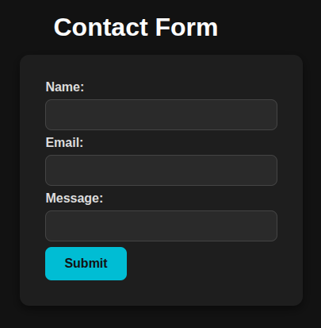
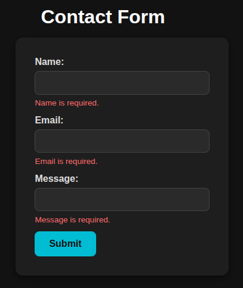
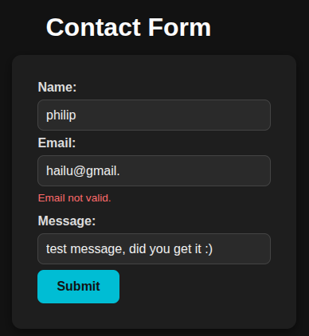
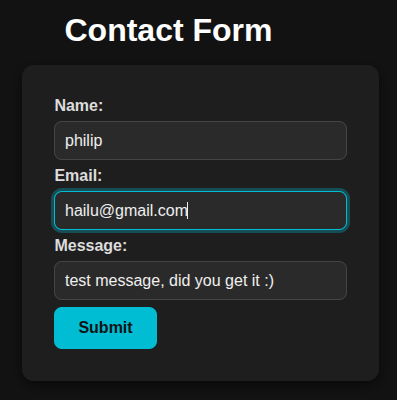
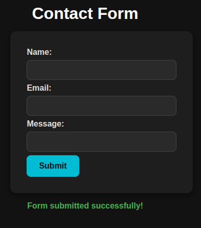

# Contact Form with React and react-hook-form

## Project Overview

This project implements a simple and elegant contact form built using React and the `react-hook-form` library. The form includes validation for required fields and proper email format, provides user-friendly error messages, and displays a success message upon submission.

## Features

- **Form Fields**: Name, Email, and Message — all required.
- **Validation**:
  - Name and Message fields must not be empty.
  - Email must be a valid email format.
- **Error Messages**: Real-time validation error messages displayed below each input.
- **Success Feedback**: A success message is shown after successful submission and disappears automatically after 4 seconds.
- **Form Reset**: Form inputs clear after submission.
- **Dark Theme UI**: Clean, responsive, and accessible dark-themed design.
- **Submit Button Disabled While Submitting**: Prevents multiple submissions.

## Technologies Used

- React (Functional Components)
- [react-hook-form](https://react-hook-form.com/) for form state management and validation
- CSS for styling

## Demo

### 1️⃣ Initial Form View



### 2️⃣ Empty Submission Attempt



### 3️⃣ Invalid Email Format



### 4️⃣ Filled Form with Correct Inputs



### 5️⃣ Successful Submission Message



## Getting Started

### Prerequisites

- Node.js (v14 or higher)
- npm package manager

### Installation

1. Clone this repository:

   ```bash
   git clone https://github.com/PhiliposHailu/A2sv-Web-Mini-Projects.git
   cd A2sv-Web-Mini-Projects/contact-form-task-5

   ```

   ```bash
    npm install

   ```

   ```bash
   npm run dev
   ```

## Author

**Philipos Hailu**  
🔗 [GitHub @philiposhailu](https://github.com/philiposhailu)  
📫 Email: hailuphilipos@gmail.com
