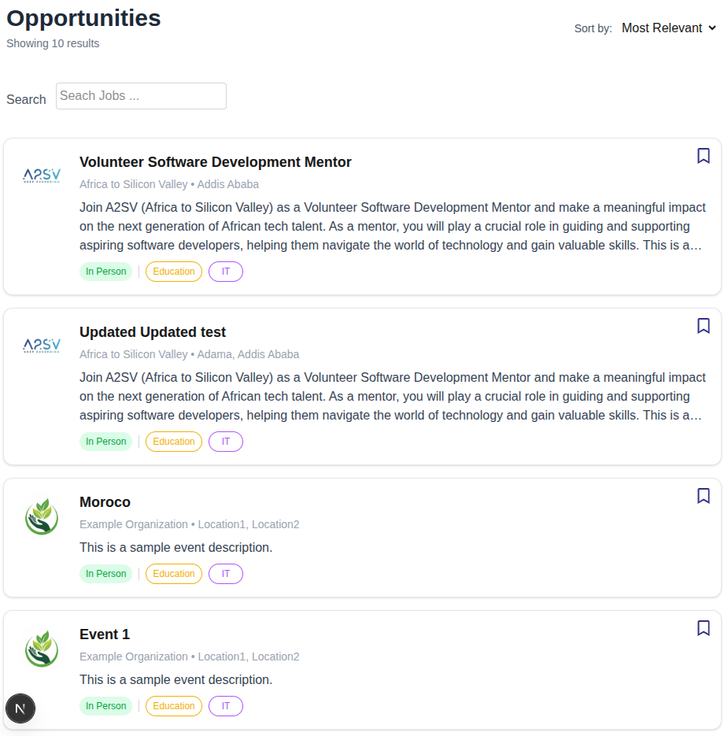
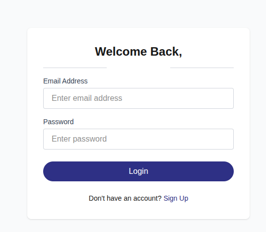
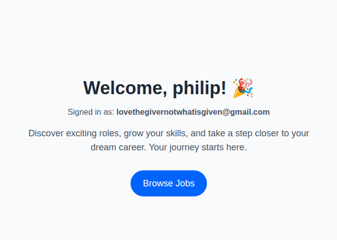
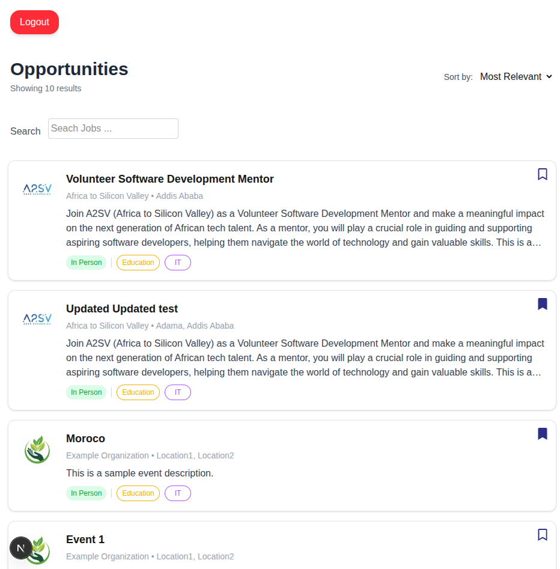
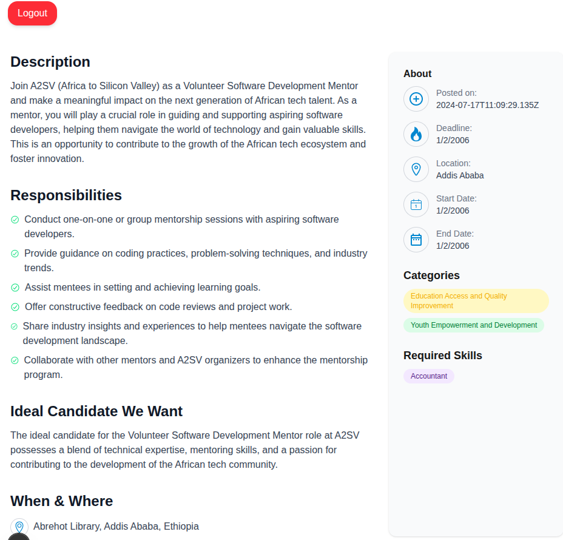
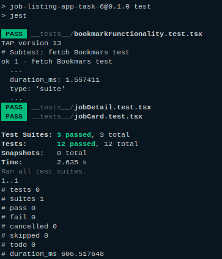
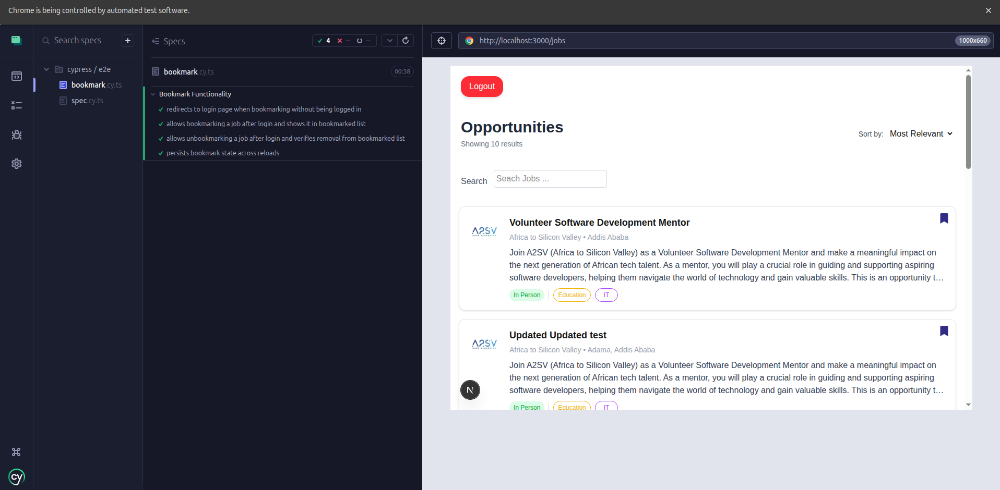

# 💼 Job Listing Application – Final Task: Bookmark Functionality
A clean, modern Job Board application built with **Next.js** and **Tailwind CSS**. It includes user authentication, email verification, and a personalized welcome dashboard.

---

## 📌 Overview
This is a job position listing application enhanced with **bookmark functionality**.  
Users can browse job postings, bookmark interesting positions, and revisit them later.  
The application uses **role-based authentication** so only logged-in users can manage bookmarks.

---

## 🎯 Objective
Enhance the job listing application by:
- Adding a **toggle button** on each job card to add/remove bookmarks.
- Ensuring **only authenticated users** can bookmark.
- **Persisting** bookmarked jobs across reloads and sessions.
- Writing **unit tests (Jest)** and **E2E tests (Cypress)** for the functionality.

---

## ✨ Features
- **Landing Page** – Public welcome screen with navigation to browse jobs.
- **Job Listings Page** – Displays dynamic job cards fetched from the API.
- **Bookmark Toggle Button** – Adds or removes a job from the user’s saved list.
- **Authentication Required** – Non-authenticated users clicking bookmark are redirected to the sign-in page.
- **Search Jobs** – Search jobs by title (works for both guests and logged-in users).
- **Job Details Page** – Click a job card to view full details.
- **Logout** – Available on the jobs page for authenticated users.
- **Persistent State** – Bookmarked jobs remain saved after reload or re-login.

---

## 🛠 Tech Stack
- **Frontend**: Next.js, React, Tailwind CSS
- **Testing**: Jest (unit tests), Cypress (E2E tests)
- **API**: [Akil Backend API](https://akil-backend.onrender.com/)
- **Authentication**: JWT (token stored in localStorage)

---

## 🔗 API Endpoints
**Base URL:** `https://akil-backend.onrender.com/`

| Method | Endpoint | Description |
|--------|----------|-------------|
| GET | `/bookmarks` | Retrieve user bookmarks |
| POST | `/bookmarks/:eventID` | Add a bookmark (empty body) |
| DELETE | `/bookmarks/:eventID` | Remove a bookmark |

---

## 🚀 Getting Started

1. Clone the repository:

```bash
git clone https://github.com/PhiliposHailu/A2sv-Web-Mini-Projects/tree/main
cd job-listing-app-bookmarks-task-9
```

2. Install dependencies:

```bash
npm install
```

3. Run the development server:

```bash
npm run dev
```

4. Open http://localhost:3000 in your browser.


## 🧪 Testing

### Unit Tests (Jest)

```bash
npm run test
```
### E2E Tests (Cypress)

```bash
npx cypress open
or
npx cypress run
```

### E2E tests include:

- Bookmarking as a logged-in user

- Redirecting unauthenticated users to sign in when bookmarking

- Verifying bookmark persistence after reload

- Removing bookmarks

## 📷 Screenshots

### 1. Landing Page  
Displays a welcome message with navigation to **Browse Jobs**.  


---

### 2. Job Listings Page (Guest)  
Shows job cards with bookmark icons.  
➡ Clicking a bookmark redirects to the **Sign-In** page.  
- Login form for registered users  
- Option to register for new users  






---

### 3. Sign-In Page  and redirected to home page




---

### 4. Job Listings Page (Authenticated)  
- Bookmarks can be toggled on/off  
- Bookmarked jobs display a `Remove bookmark` **aria-label**  


---

### 5. Bookmarked Jobs Persistence and toggleing works
- After reload or re-login, previously bookmarked jobs remain bookmarked 




---

### 6. Job Details Page  
- Displays full job description and details fetched from the API  



---

### 7. Logout Button  
- Logs out the user  
- Clears session data
- redirects to home page  


---

## 🧹 Code Quality  

- Clean and modular code following best practices  
- Error handling for failed API calls  
- Accessible UI with `aria-label` attributes for bookmark toggles  


## 📷 Testing

### 1. Jest Testing  


 

---

### 2. Cypress Testing


  

---


## Project Structure

```bash

├── app
│   ├── components
│   ├── favicon.ico
│   ├── globals.css
│   ├── jobs
│   ├── layout.tsx
│   ├── login
│   ├── page.tsx
│   ├── signup
│   ├── types
│   └── verify
├── public
│   ├── data
│   └── imgs
└── README.md

```

## Author

**Philipos Hailu**  
🔗 [GitHub @philiposhailu](https://github.com/philiposhailu)  
📫 Email: hailuphilipos@gmail.com