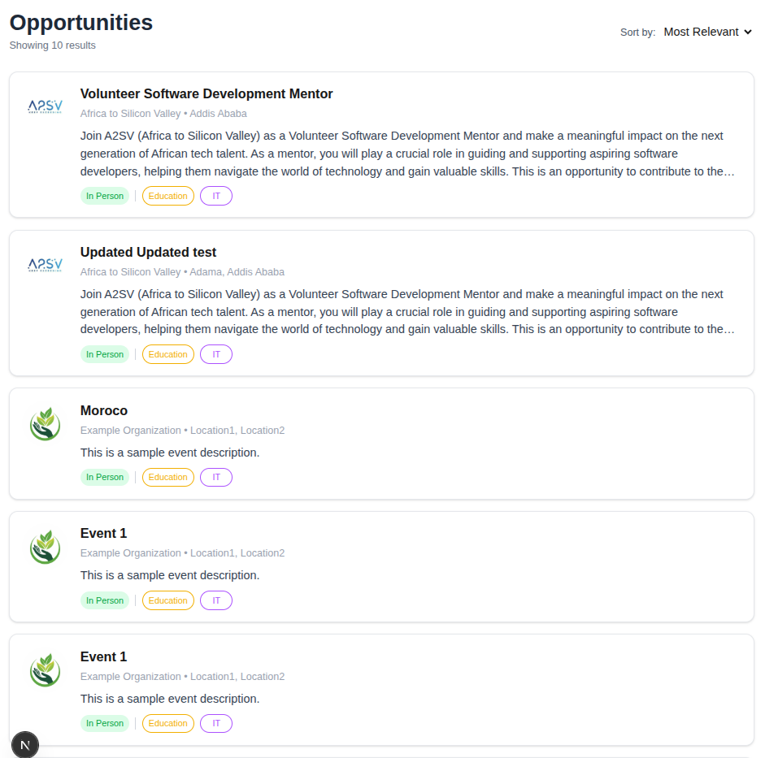
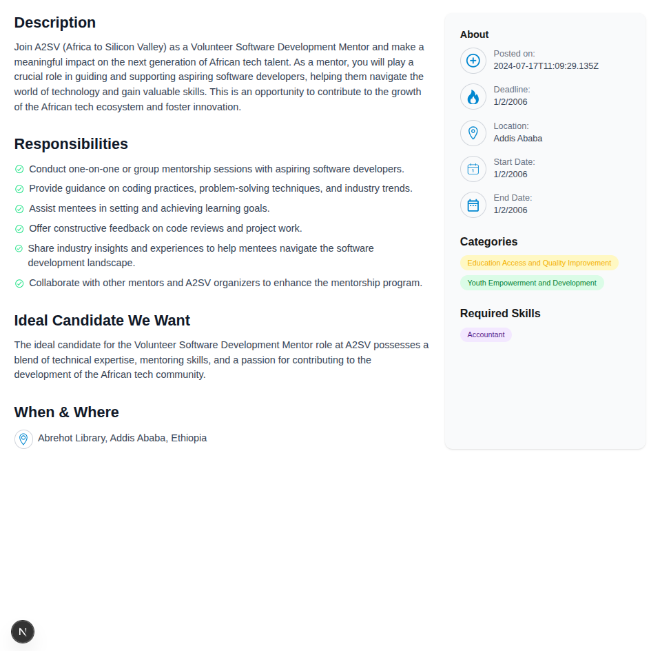

# 🧑‍💼 Job Listing Application with Next.js

## 🚀 Project Overview

This project showcases a **Job Listing Application** built using **Next.js 14 App Router** with **TypeScript** and **Tailwind CSS**. The app displays a list of job opportunities with detailed job descriptions.

## 🔍 Features

- **Dynamic Job Data** fetched via API route (`/api/jobs`)
- **Job Cards**: Title, company, location, short description, and logo
- **Detail Page**: Full description, responsibilities, candidate traits, job dates, and skills
- **Client-Side Navigation** using dynamic routing (`/jobs/[slug]`)
- **Fallback Image** support when no logo is provided

## 🛠️ Technologies Used

- [Next.js 14](https://nextjs.org/)
- [TypeScript](https://www.typescriptlang.org/)
- [Tailwind CSS](https://tailwindcss.com/)
- [ESLint + Prettier] for code formatting

---

## 🧭 Pages & Screenshots

### Front Page (`/`)

**Welcome to Your Next Opportunity** landing page with a button to browse jobs.


### Jobs Listing (`/jobs`)

**Opportunities** header, showing count of `x results`, a `Sort by` dropdown, and a grid of job cards.



### Job Detail (`/jobs/[slug]`)

Full job details, including:

- Description
- Responsibilities list
- Ideal Candidate section
- When & Where details
- Sidebar with About, Categories, and Required Skills



## 📦 Getting Started

### 🔧 Prerequisites

- Node.js v16+
- npm or yarn

## 🚀 How to Run Locally

1. Clone the repository:

```bash
git clone https://github.com/PhiliposHailu/A2sv-Web-Mini-Projects/tree/main
cd job-listing-app-dynamic-task-7
```

2. Install dependencies:

```bash
npm install
```

3. Run the development server:

```bash
npm run dev
```

4. Open http://localhost:3000 in your browser.

## Project structure

```bash
job-listing-app/
├── app/
│   ├── page.tsx
│   ├── jobs/
│   │   └── [slug]/
│   │       └── page.tsx
├── components/
│   ├── JobCard.tsx
│   ├── JobList.tsx
├── data/
│   └── jobs.json
├── types/
│   └── JobType.ts
├── public/
│   └── imgs/
└── README.md
```

## Author

**Philipos Hailu**  
🔗 [GitHub @philiposhailu](https://github.com/philiposhailu)  
📫 Email: hailuphilipos@gmail.com
