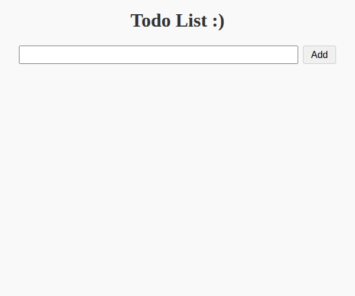

# 📝 ToDo List App

A simple, clean, and interactive ToDo list application built using **HTML**, **CSS**, and **JavaScript**.

## ✅ Features

- Add new tasks
- Edit existing tasks
- Delete tasks
- Mark tasks as complete (with line-through styling)

## 🚀 How It Works

### ➕ Add a Task

- Type your task into the input field.
- Click the **"Add"** button to insert it into the task list.

.png)
.png)

### ✅ Complete a Task
- Click the **checkbox** next to a task to mark it as completed.
- The task will get a **line-through** to indicate completion.

.png)

### 📝 Edit a Task
- Click the **"Edit"** button next to a task.
- The task text becomes editable.
- Click **"Save"** to confirm your changes.

.png)
.png)

### ❌ Remove a Task
- Click the **"Delete"** button next to a task to remove it from the list.

.png)

## 🛠️ Tech Stack

- HTML
- CSS (vanilla)
- JavaScript (no libraries)

## 📂 File Structure
todo-app-js-task1/
├── index.html
├── css/
│ └── style.css
├── js/
│ └── index.js
└── README.md
└── images
   -
   -
   -

