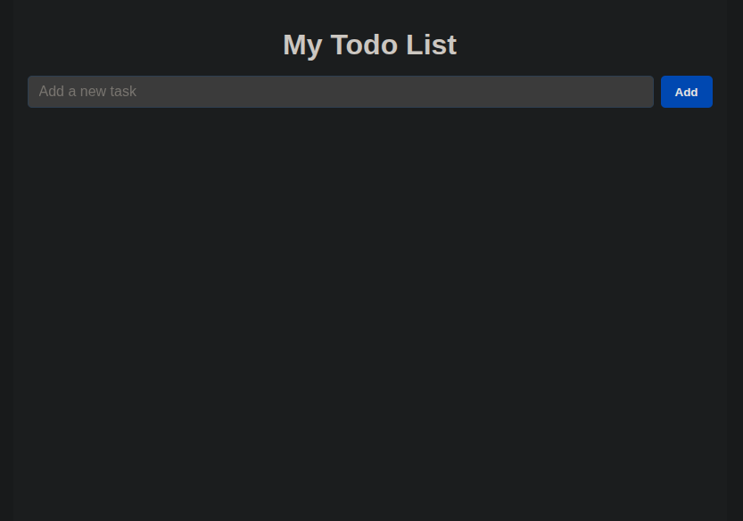
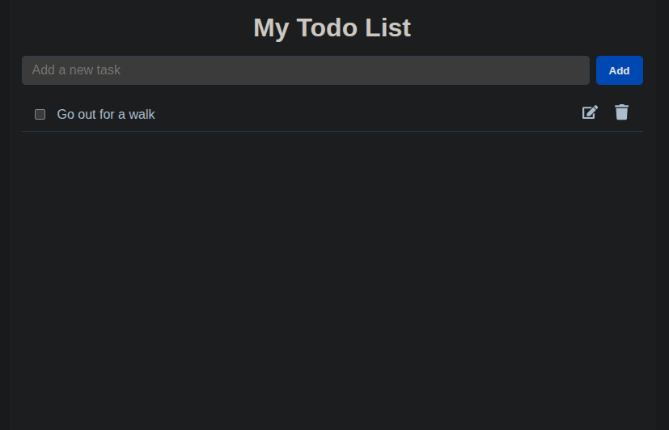
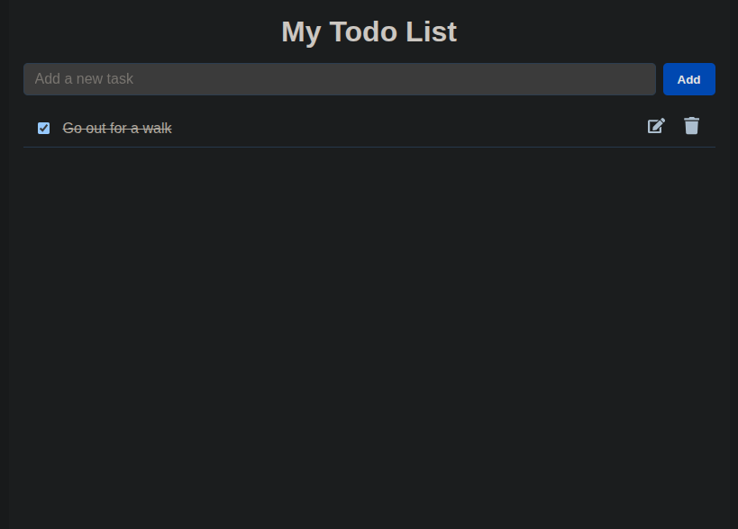
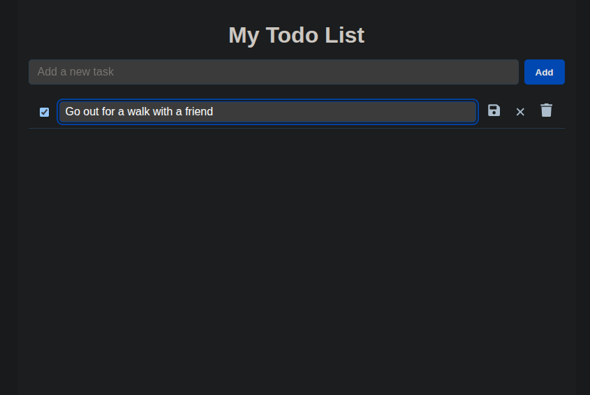
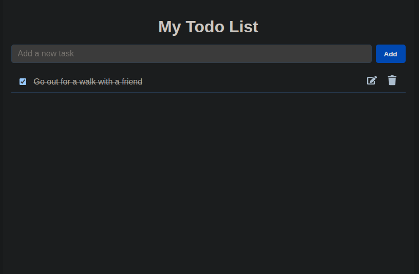
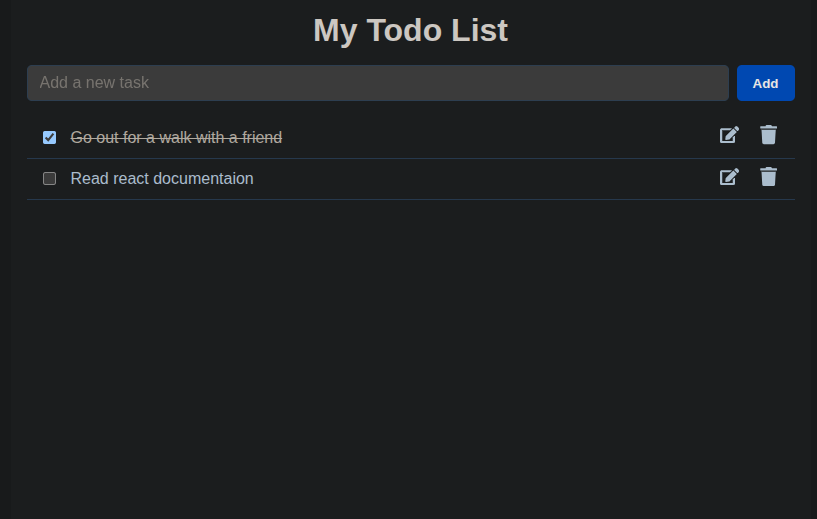
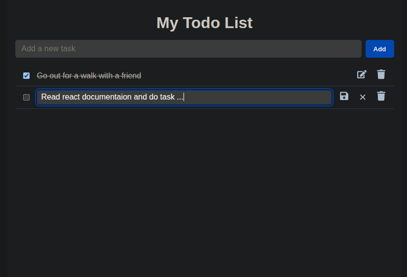
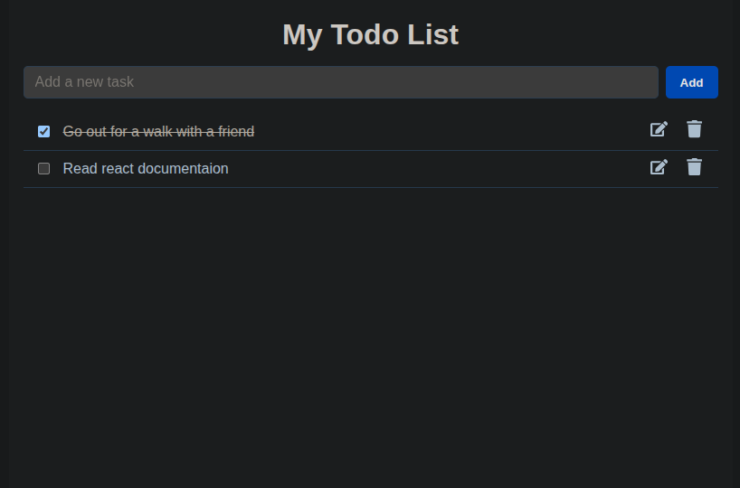
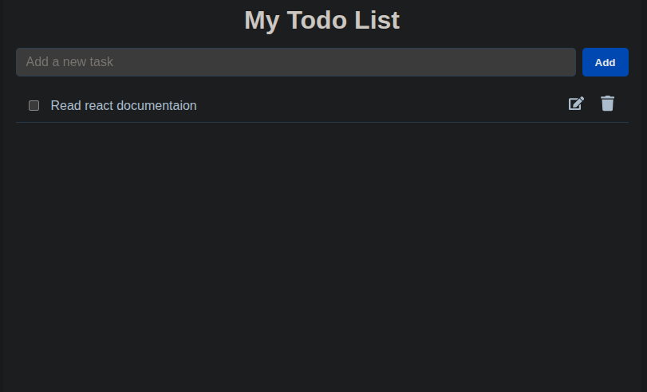

# React Todo App with LocalStorage

## 🌊 Overview

This is a simple yet powerful Todo App built using **React** with **TypeScript**, featuring:

- Adding, editing, and deleting tasks
- Task completion toggle with checkbox
- Persistent storage using `localStorage`
- Component-based structure
- Clean separation of CSS

## 🔧 Tech Stack

- React (via Vite)
- TypeScript
- CSS Modules / App-wide CSS
- LocalStorage API

---

## 🔄 Features

- **Add Task**: Type and press enter or click add button
- **Edit Task**: Click edit, modify the task, then save or cancel
- **Delete Task**: Click delete icon
- **Mark Complete**: Click checkbox to toggle completion
- **Persistent**: Tasks are saved in your browser's localStorage

---

## 📖 File Structure

```
── src
│   ├── App.tsx
│   ├── componets
│   │   ├── CRUD
│   │   │   ├── addNewTask.tsx
│   │   │   ├── deleteTask.tsx
│   │   │   ├── getTasks.tsx
│   │   │   ├── storage.tsx
│   │   │   └── updateTask.tsx
│   │   ├── TodoItem.tsx
│   │   ├── TodoList.tsx
│   │   └── types
│   │       ├── TodoItemProps.tsx
│   │       └── TodoTypes.tsx
│   ├── css
│   │   └── App.css
│   ├── global.d.ts
│   ├── images
│   │   ├── addingNewTask_2.png
│   │   ├── cancel_6_1.png
│   │   ├── cancel_6_2.png
│   │   ├── cancel_6_3.png
│   │   ├── delete_7.png
│   │   ├── edit4.png
│   │   ├── first_1.png
│   │   ├── save_5.png
│   │   └── taskCompleted_3.png
│   └── main.tsx

```

---

## ⚡ Setup & Run

### 1. Clone this repo

```bash
git clone https://github.com/PhiliposHailu/A2sv-Web-Mini-Projects
cd todo-app-react-task4
```

### 2. Install dependencies

```bash
npm install
```

### 3. Run the development server

```bash
npm run dev
```

Visit `http://localhost:5173` in your browser to see the app.

---

## 📝 Features & Instructions

### 1. ➕ Adding a New Task

Click the input field at the top and type your task, then press **Enter** to add it to the list.





---

### 2. ✅ Mark Task as Completed

Click the **checkbox** next to a task to mark it as completed. Completed tasks will be **crossed out**.



---

### 3. ✏️ Edit a Task

Click the **Edit** button on a task to change its text.



---

### 4. 💾 Save Changes

After editing, click **Save** to confirm your changes.



---

### 5. ❌ Cancel Edit

Click **Cancel** if you want to discard your changes.







---

### 6. 🗑️ Delete a Task

Click the **Delete** button to permanently remove a task from the list.



## 🚀 Future Improvements

- Due date support
- Task categories (All, Completed, Incomplete ... )
- Drag and drop reordering

---

## 👋 Acknowledgements

Inspired by simple todo apps and React component design best practices.

---

## ✉ Contact

Feel free to reach out at [hailuphilipos@gmail.com](mailto:hailuphilipos@gmail.com) or raise an issue/pull request.

Happy coding! 🚀
