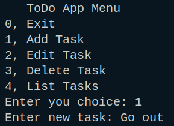
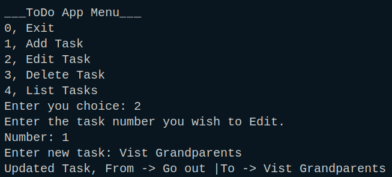
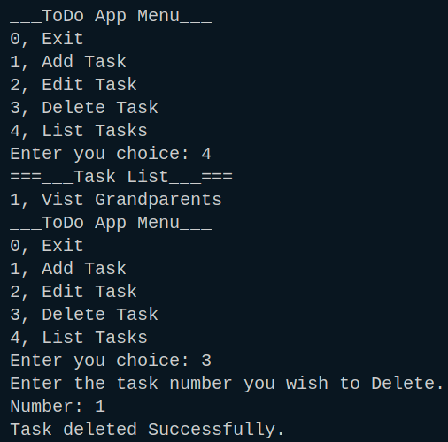
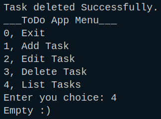
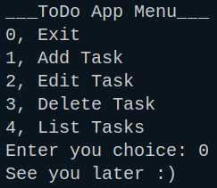

# 📝 TypeScript To-Do App

This is a simple command-line To-Do list application built using **TypeScript** and **Node.js**. It allows users to add, edit, delete, view, and manage tasks directly from the terminal.

---

## 🚀 Features

- Add new tasks
- Edit existing tasks
- Delete tasks
- View all tasks
- Data stored in-memory (temporary, not persisted after exit)

---

## 🛠️ Requirements

Make sure you have the following installed:

- **Node.js**
- **TypeScript** (globally or locally in the project)

---

## ▶️ Running the App

1. **Clone the repo**
2. **Install dependencies**
```bash
npm install
```
3. **Compile the TypeScript Code**
```bash
tsc src/todo.ts
```

4 **Run the Compiled JavaScript**
```bash
node dist/todo.js
```

- **Add Task** → Press `1`, then type your task and hit Enter.




- **Edit Task** → Press `2`, enter the task number you want to edit, then enter the new task name.



- **Delete Task** → Press `3`, enter the task number you want to remove.



- **List Tasks** → Press `4` to see all tasks.



- **Exit** → Press `0` to quit the app.



## 🛠️ Tech Stack

- HTML
- CSS (vanilla)
- TypeScript (no libraries)

## 📂 File Structure

├── src/
│ └── todo.ts
├── dist/
│ └── todo.js 
├── images/ 
│ ├── 1.png
│ ├── 2.png
│ └── ...
└── README.md 

Other extra files and commented section of the todo.js are for the web version of the same functionalities.


## 🧑‍💻 Author

Created by **[Philipos Hailu]**
